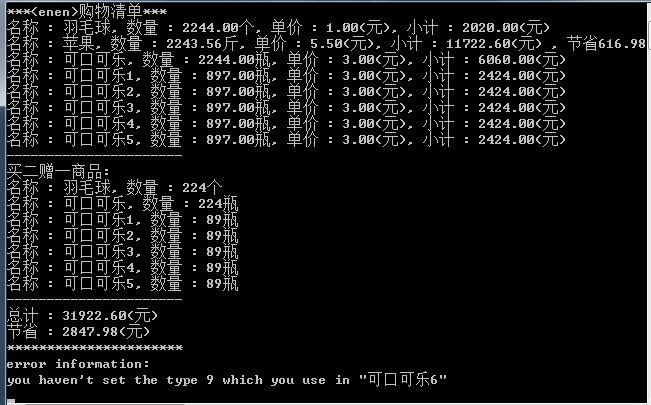
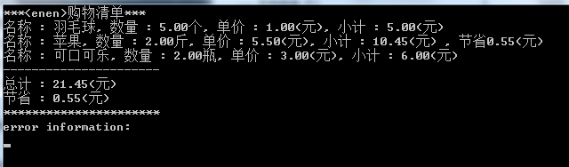

###How to use it
1. you should config the goods in config.json(you should offer the full path) by using this format:

		[
			{
				"barcode": string,
				"name": string,
				"category": string,
				"price": num,
				"rebate_type":num	(1: buy 2 then give 1, 2: 5% discount, 3: both)
			},
			{ ... },
			...
		]

2. you should offer the barcode.json that include the information of barcode. 
3. you should come up with a name for your shop
4. print it
####for example:

		#include <iostream>

		#include "Rebate.h"
		#include "Shop.h"

		int main()
		{

			Shop shop("enen");
			shop.ConfigGoodsByFile("D:\\config.json");
			shop.ParseBarcodeByFile("D:\\barcode.json");
			shop.Print();

			std::cin.get();
			return 0;
		}

###Other Imfomation

####my test:

####error information:

whether show the "error information" depends on "#define" SHOW_ERROR or not 
